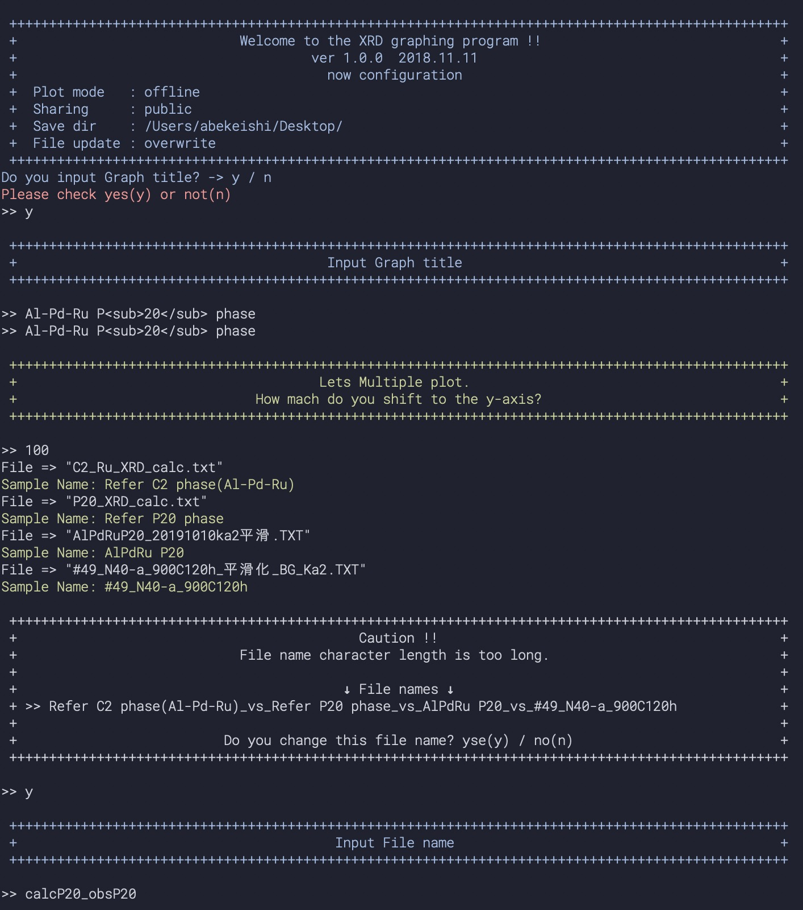

# XRD描画用スクリプト

x-y形式のファイルなら自動的にデータを抽出し、XRDグラフを描画します。  
複数のXRD描画に対応しており、自動的にOffestをかけることも指定することも可能です。  
研究しながらプログラミング学習がてらに作ったので関数の切り分けとかかなり雑。ごめん  

> デモ
> 
>  

## 機能

- x-yフォーマットデータのグラフ化
- マルチプロット
- インタラクティブグラフ(plotly)
- ターミナルに表示される枠をターミナル幅に合わせるようにした